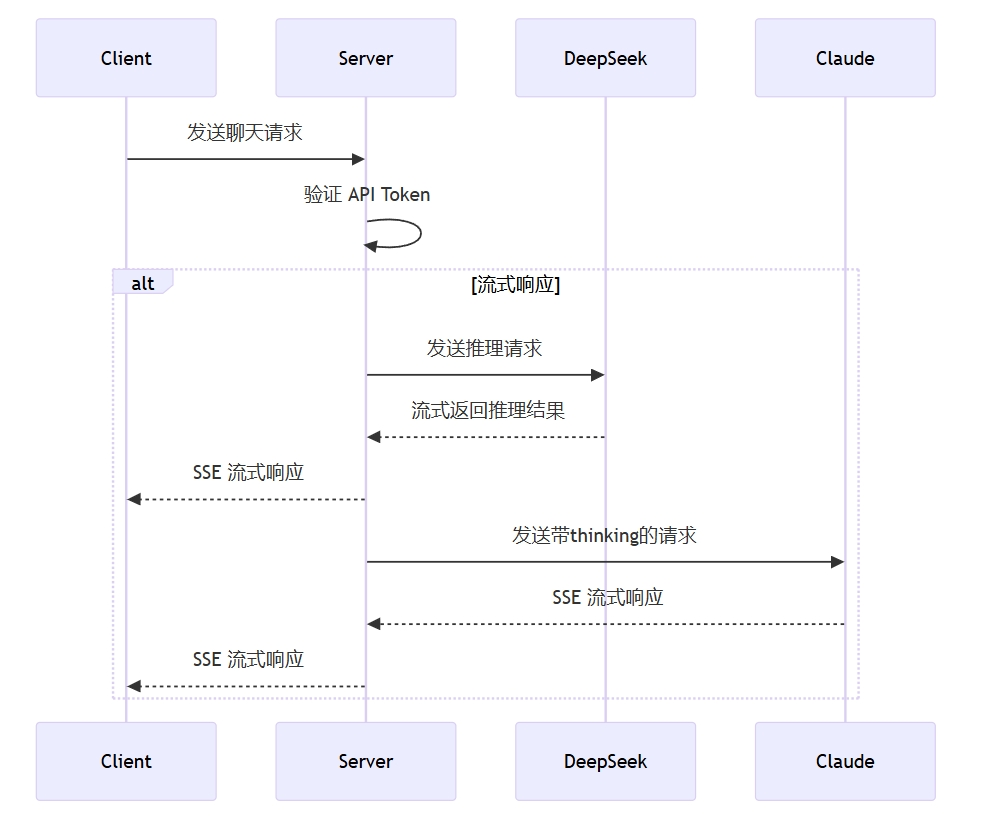

<div>
<h1>DeepClaude 🐬🧠 - OpenAI Compatible</h1>

<a href="https://github.com/getasterisk/deepclaude"> Inspiration from getasterisk/deepclaude</a>

[](#)
[](https://openai.com)


# 特点

<h3 style="color: #FF9909">官方计费API服务！微信：LingNeverLove </h3>
</div>

---

<details>
<summary><strong>更新日志：</strong></summary> 

<div>
2025-02-06.1：支持OpenAI兼容格式，支持第三方托管的API。

</div>
</details>


# Table of Contents

- [Table of Contents](#table-of-contents)
- [Introduction](#introduction)
- [Implementation](#implementation)
- [How to run](#how-to-run)
  - [1. 获得运行所需的 API](#1-获得运行所需的-api)
  - [2. 开始运行](#2-开始运行)
- [Deployment](#deployment)
- [Technology Stack](#technology-stack)
- [Star History](#star-history)
- [Buy me a coffee](#buy-me-a-coffee)
- [About Me](#about-me)

# Introduction
最近 DeepSeek 推出了 [DeepSeek R1 模型](https://platform.deepseek.com)，在推理能力上已经达到了第一梯队。但是 DeepSeek R1 在一些日常任务的输出上可能仍然无法匹敌 Claude 3.5 Sonnet。Aider 团队最近有一篇研究，表示通过[采用 DeepSeek R1 + Claude 3.5 Sonnet 可以实现最好的效果](https://aider.chat/2025/01/24/r1-sonnet.html)。


> **R1 as architect with Sonnet as editor has set a new SOTA of 64.0%** on the [aider polyglot benchmark](https://aider.chat/2024/12/21/polyglot.html). They achieve this at **14X less cost** compared to the previous o1 SOTA result.

并且 Aider 还 [开源了 Demo](https://github.com/getasterisk/deepclaude)，你可以直接在他们的项目上进行在线体验。


本项目受到该项目的启发，通过 fastAPI 完全重写，并支持 OpenAI 兼容格式，支持 DeepSeek 官方 API 以及第三方托管的 API。

用户可以自行运行在自己的服务器，并对外提供开放 API 接口，接入 [OneAPI](https://github.com/songquanpeng/one-api) 等实现统一分发（token 消耗部分仍需开发）。也可以接入你的日常 ChatBox  软件以及 接入 [Cursor](https://www.cursor.com/) 等软件实现更好的编程效果（Claude 的流式输出+ Tool use 仍需开发）。

# Implementation
⚠️Notice: 目前只支持流式输出模式（因为这是效率最高的模式，不会浪费时间）


# How to run

> 项目支持本地运行和服务器运行，本地运行可与 Ollama 搭配，实现用本地的 DeepSeek R1 与 Claude 组合输出


## 1. 获得运行所需的 API


   注：`提供**官方计费**的 DeepClaude 的直接 API 服务！微信：LingNeverLove`

## 2. 开始运行
Step 1. 克隆本项目到适合的文件夹并进入项目

```bash
git clone https://github.com/Cupcc/DeepClaude.git
cd DeepClaude
```

Step 2. 安装依赖

```bash
pip install .
```

Step 3. 配置环境变量

```bash
# 复制 .env 环境变量到本地
cp .env.example .env
```

Step 4. 按照环境变量当中的注释依次填写配置信息
```
# 请求本API服务时需要的API Key
ALLOW_API_KEY=sk-dqC7ZTa9mCxxxxxx

# 调用的API
BASE_API_KEY=sk-tRVVCcCmQq8***************rVDh2orcMn
BASE_API_URL=https://xxxxxxx/v1/chat/completions
```

Step 5. 本地运行程序

```bash
# 本地运行
uvicorn app.main:app --host 0.0.0.0 --port 9013
```

Step 6. 配置程序到你的 Chatbox（推荐 [NextChat](https://nextchat.dev/)、[ChatBox](https://chatboxai.app/zh)、[LobeChat](https://lobechat.com/)）

```bash
# 通常 baseUrl 为：http://127.0.0.1:9013/v1
# 或者为http://127.0.0.1:9013
```


# Deployment

> 项目支持 Docker 服务器部署，可自行调用接入常用的 Chatbox，也可以作为渠道一直，将其视为一个特殊的 `DeepClaude`模型接入到 [OneAPI](https://github.com/songquanpeng/one-api) 等产品使用。

项目地址[https://hub.docker.com/repository/docker/chris2023cui/deepclaude-server](https://hub.docker.com/repository/docker/chris2023cui/deepclaude-server)


# Technology Stack
- [FastAPI](https://fastapi.tiangolo.com/)
- [UV as package manager](https://docs.astral.sh/uv/#project-management)
- [Docker](https://www.docker.com/)

# Star History


[](https://star-history.com/#cupcc/deepclaude&Date)